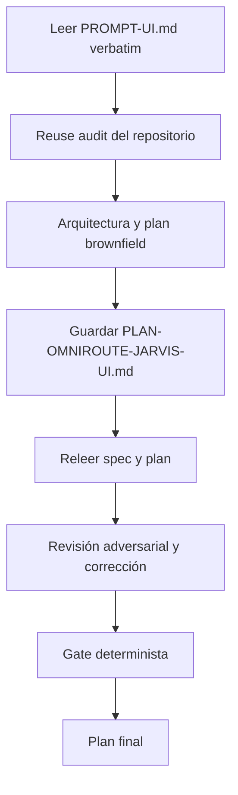

```mermaid
flowchart TD
  A[Leer PROMPT-UI.md verbatim] --> B[Reuse audit del repositorio]
  B --> C[Arquitectura y plan brownfield]
  C --> D[Guardar PLAN-OMNIROUTE-JARVIS-UI.md]
  D --> E[Releer spec y plan]
  E --> F[Revisión adversarial y corrección]
  F --> G[Gate determinista]
  G --> H[Plan final]
```
