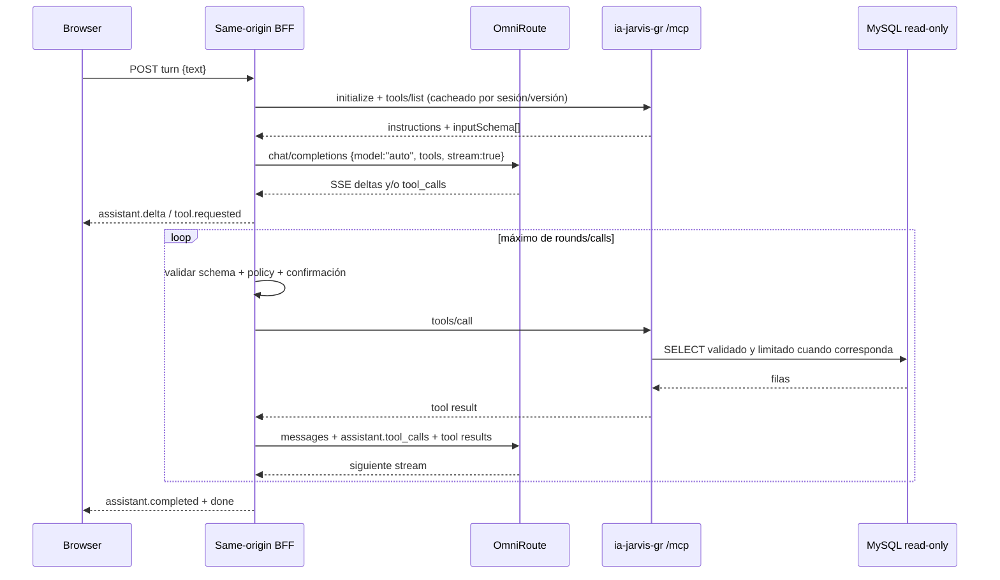

# Plan brownfield: Jarvis UI + OmniRoute + `ia-jarvis-gr`

**Estado:** plan de implementación; no contiene implementación de producto.  
**Repositorio inspeccionado:** `/home/fulanito/development/mcp-bd`  
**Fuente funcional:** `PROMPT-UI.md`  
**Principio de entrega:** primero el vertical slice real micrófono→FFT→shader; después integración Jarvis, STT experimental y TTS; el acabado estético solo tras probar reactividad.

## Decisiones no negociables

1. El MCP Go actual seguirá siendo un servicio independiente. No se duplicará su acceso a MySQL, su validador SQL, su store SQLite ni sus tools en la aplicación web.
2. El navegador solo hablará con un BFF del mismo origen. Las claves de OmniRoute, el bearer de `ia-jarvis-gr` y las credenciales de MySQL nunca llegarán a JavaScript, HTML, URLs, logs del navegador ni variables `VITE_*`.
3. Chat usará exactamente `model: "auto"` en el endpoint OpenAI-compatible de chat completions de OmniRoute. Forma abreviada para trazabilidad del gate: model: `auto`. `auto` aporta selección dinámica y fallback entre conexiones disponibles; **no** promete solicitudes infinitas ni evita que se agoten cuotas o fallen todos los upstreams.
4. TTS y STT tendrán modelos speech explícitos, descubiertos y validados contra la instancia instalada. No se asumirá que `model: "auto"` sea válido para TTS ni STT; `auto` queda reservado al chat.
5. Habrá dos modos inequívocos. **Strict-private**, activado por defecto, usa el micrófono solo para visualización local y exige escribir el input: ningún byte de audio sale del navegador. **Voice-conversation experimental**, desactivado por defecto, requiere consentimiento/divulgación separados antes de cada sesión de voz y envía únicamente una captura acotada, de forma transitoria y por el BFF same-origin, a un endpoint/modelo STT de OmniRoute verificado. El transcript se muestra para revisar/editar/descartar antes de enviarlo al agente.
6. En ambos modos, el análisis que alimenta `AudioFeatures`, Three.js y shaders permanece completamente local. No habrá audio simulado, envolventes pregrabadas, valores aleatorios, ecualizador de barras ni cadencia de tokens fingiendo reactividad. En strict-private no se crea ningún encoder/recorder; en modo experimental la rama de captura existe solo durante push-to-talk, con límites duros y cleanup inmediato.
7. El modo experimental constituye una **excepción intencional al criterio de privacidad de `PROMPT-UI.md`**, necesaria por la petición actual de conversar por voz; nunca se presentará como cumplimiento del criterio «el micrófono no sale del navegador».
8. Mientras Jarvis hable, audio TTS real deberá atravesar un `AnalyserNode` antes de llegar a la salida. Si TTS no está disponible, se mostrará texto y un estado de fallback; no se mostrará `SPEAKING` falso.
9. React gestionará estados gruesos, controles y ciclo de vida. FFT, arrays de frecuencia y `AudioFeatures` por frame serán mutables y no pasarán por `setState`.
10. Stack web: React + TypeScript + Vite + Three.js directo + Web Audio API + WebGL2 + GLSL. No React Three Fiber y no Ollama.

## Reuse-audit findings (REVIEW BEFORE PROCEEDING)

### Estado brownfield y protección del trabajo del usuario

- El repositorio está en `main`, commit `724603f`.
- Hay cambios del usuario que deben permanecer intactos: seis archivos versionados bajo `knowledge/` están eliminados en el worktree, y `.a5c/` está sin seguimiento. Este plan no los restaura, modifica ni elimina.
- Antes de cada fase se ejecutará `git status --short`; cualquier automatización limitará sus escrituras a `web/`, documentación aprobada y, solo si se acuerda expresamente, integración de despliegue.
- `PLAN-OMNIROUTE-JARVIS-UI.md` no existía al iniciar esta auditoría.
- Las eliminaciones actuales dejan `knowledge/index.md` y `knowledge/business/*.md` ausentes; `internal/knowledge/loader.go` tolera su ausencia y arranca con mapas vacíos. No se restaurarán ni reconstruirán: antes de aceptar respuestas de negocio se validará el comportamiento real y se consultará al usuario si esa pérdida de documentación no era intencional.
- Las imágenes de referencia mencionadas por `PROMPT-UI.md` no están en el repositorio ni en el task de revisión. Antes del polish de Phase 7 se deben localizar/solicitar y convertir en criterios visuales revisables; no se inventará fidelidad a imágenes no disponibles.

### Código, rutas y UI existentes

| Área auditada | Evidencia actual | Decisión de reutilización |
|---|---|---|
| Entrada del servicio | `cmd/server/main.go` | Mantener. No convertir el proceso Go en servidor web de UI ni en orquestador LLM. |
| API/HTTP existente | Única ruta HTTP de producto: `POST/GET/DELETE` MCP Streamable HTTP en `/mcp`, montada en `cmd/server/main.go` | Reutilizar desde el BFF mediante un cliente MCP. No es una API REST de navegador. |
| Transporte MCP | `stdio` o `http`; HTTP es stateful, con sesiones y TTL de 30 minutos | Usar `MCP_TRANSPORT=http` para el BFF; conservar `stdio` para otros clientes. |
| Autenticación MCP | `internal/mcpserver/auth.go`: `Authorization: Bearer`, comparación constante | El BFF conserva el token en servidor. El navegador no llama `/mcp` directamente. |
| MySQL | `internal/database/database.go`: pool, `SET SESSION TRANSACTION READ ONLY` en cada conexión | Reutilizar sin cambios. BFF nunca conecta directamente a MySQL. |
| Defensa SQL | `internal/security/validator.go`, usuario DB read-only, límites en `internal/query/engine.go` | Reutilizar. La app no crea un segundo motor SQL. |
| Riesgo existente del query engine | `internal/query/engine.go` asigna campos de `result` antes de comprobar el error de `scanRows`; un error de scan/límite de columnas puede dejar `result=nil` | Añadir gate de reproducción y test de regresión antes de exponer consultas. Si se confirma, detener la integración y corregirlo como cambio Go separado; no ocultarlo en la UI. |
| Metadata | SQLite en `data/mcp.db`, migraciones embebidas `0001`–`0004` | No se requiere migración para la primera UI. Conversaciones web serán efímeras/acotadas. |
| Tools | 20 tools registradas en `internal/mcpserver/tools_*.go`; `README.md` aún enumera 19 y omite `obtener_estadisticas_uso` | Tomar `tools/list` como contrato runtime; no copiar esquemas a mano ni confiar en el conteo desactualizado del README. |
| Prompts Jarvis | `.claude/commands/jarvis.md` canónico, adaptación OpenCode y `INSTALL.md` | Derivar un prompt BFF específico; conservar personalidad, `recordar_contexto` primero y regla de no inventar. Eliminar nombres client-specific como `mcp__jarvis__*`. |
| UI/package manager | No hay `package.json`, `src/`, Vite, React ni Three.js en el proyecto | Crear una aplicación aislada en `web/`; no mezclar Node con paquetes Go. |
| Dependencias | Solo Go en `go.mod`; no hay dependencias JS de producto | Verificar y fijar candidatas antes de instalar; commitear lockfile. |
| Variables de entorno | `.env.example` contiene `MCP_*`, `DB_*` y límites; no contiene OmniRoute/UI | Añadir ejemplo separado para BFF; nunca reutilizar prefijos públicos `VITE_*` para secretos. |
| Docker | `docker-compose.yml` solo define `db-intelligence-mcp`; el puerto HTTP está comentado | No cambiar inicialmente. Añadir despliegue web solo después de validar localmente y revisar red/TLS. |
| Tests | `go test ./...` pasa al redactar este plan | Mantener como gate de regresión en todas las fases. |

### Inventario de tools y política inicial

El runtime registra 20 tools. MySQL es read-only, pero el middleware de `internal/mcpserver/server.go` actualiza `tool_usage` para **toda** llamada, `consultar_base_datos` además guarda historial/auditoría, y varias tools mutan conocimiento, alias o caché. Por tanto, «read-only» abajo significa «sin mutación de conocimiento de negocio ni de MySQL», no ausencia literal de escrituras operativas en SQLite. El BFF no confiará en que el modelo decida su propia autorización.

- **Autoejecutables de lectura de negocio, sujetas a autenticación, egress y límites:** `recordar_contexto`, `obtener_conocimiento_negocio`, `buscar_conocimiento`, `obtener_conocimiento_validado`, `obtener_entidad`, `obtener_relaciones`, `obtener_esquema_bd`, `obtener_esquema_tabla`, `buscar_en_base_datos`, `consultar_base_datos`, `explicar_consulta`, `obtener_conocimiento_pendiente`, `obtener_estadisticas_uso`.
- **Confirmación visible ligada al nombre y argumentos exactos antes de ejecutar:** `refrescar_esquema`, `registrar_observacion`, `proponer_conocimiento`, `aprender_del_usuario`. La confirmación de `aprender_del_usuario` destacará que sus alias se aplican inmediatamente aunque la propuesta quede pendiente.
- **Deny-by-default hasta resolver identidad/autorización humana; después confirmación reforzada:** `aprobar_conocimiento`, `rechazar_conocimiento`, `actualizar_alias`. El repositorio solo autentica al cliente MCP mediante un bearer compartido; no existe evidencia de usuarios o roles administrativos. `aprobado_por`, `rechazado_por` y `actualizado_por` nunca se aceptarán como prueba de identidad enviada por el browser.
- La clasificación será una constante server-side contrastada al arrancar con `tools/list`. Un nombre nuevo, no descubierto, fuera de lista o cuyo schema cambió se rechaza y abre un gate de revisión; no se autoriza por descripción generada por el modelo.
- La ejecución paralela comienza deshabilitada (`1` llamada a la vez). Solo podrá habilitarse para un subconjunto estático, idempotente y probado; el modelo no decide qué llamadas son «independientes».
- `consultar_base_datos` no modifica MySQL, pero su resultado puede enviarse al proveedor elegido por OmniRoute. Antes de producción debe aprobarse una política de egress por tabla/columna/PII; `MCP_EXCLUDED_*` actual es una defensa parcial, no autorización por usuario.

### Auditoría de OmniRoute actual

Fuentes suministradas revisadas:

- `AUTO-COMBO.md` se identifica como v3.8.40 y documenta `model: "auto"`, pool dinámico de conexiones activas, credenciales válidas, scoring de cuota/salud/coste/latencia y fallback.
- `docs/openapi.yaml` se identifica como v3.8.50 y documenta Bearer auth, chat streaming, `tools`, `tool_choice`, `tool_calls`, TTS, STT y listado de modelos.
- La wiki documenta URLs públicas `/v1/...`; el OpenAPI actual enumera rutas `/api/v1/...`. Esta diferencia de prefijo es version-sensitive y **no se resolverá por suposición**.
- La wiki de audio menciona actualmente STT con `deepgram/nova-3` y `assemblyai/best`, y muestra TTS con `openai/tts-1`; son ejemplos de la documentación, no una garantía sobre la instalación del usuario.
- No se encontró binario, proceso, contenedor, listener en 20128/20130 ni variables `OMNIROUTE_*` en esta sesión. Los probes sin autenticación a `127.0.0.1:20128` no conectaron. Por tanto, no se pudo validar una instancia instalada.

**Gate obligatorio antes de Phase 9 (chat), Phase 11 (STT experimental) y Phase 12 (TTS):** arrancar/identificar la instancia real, obtener su OpenAPI correspondiente a esa versión, fijar `OMNIROUTE_OPENAI_BASE_URL` con el prefijo comprobado, y validar con Bearer `GET {base}/models` y una petición mínima de chat. STT y TTS requieren además descubrir y probar por separado rutas, modelos speech explícitos, formatos y límites; `auto` no es fallback para ninguno. La ausencia de OmniRoute no bloquea el visualizador local de Phases 1–8; sí bloquea chat/STT/TTS. No continuar esas ramas si el contrato instalado contradice este plan: actualizar el plan primero.

## Alcance y fuera de alcance

### Incluido

- Conversación de texto con streaming, OmniRoute `auto` y loop MCP real.
- Dos modos explícitos: strict-private por defecto (visualización local + input escrito, cero egress de micrófono) y voice-conversation experimental opt-in (captura push-to-talk acotada → BFF same-origin → STT OmniRoute verificado → transcript revisable).
- Análisis visual exclusivamente local del micrófono en ambos modos. El visualizador base implementa primero `MicrophoneAudioSource`, como exige `PROMPT-UI.md`; la integración Jarvis añade `TTSAudioSource` únicamente en Phase 12 y solo con audio real analizable para `SPEAKING`.
- Organismo Three.js/WebGL2 con shaders, partículas, bloom, órbitas, quality scaling y cleanup.
- Seguridad BFF, consentimiento separado, límites de captura, cancelación, barge-in, estados, pruebas, observabilidad sin contenido de audio/transcript y trazabilidad de aceptación.

### Fuera de alcance inicial

- Cambiar las 20 tools runtime, el protocolo o la persistencia del MCP Go.
- Escribir en MySQL de producción.
- Persistencia multiusuario de conversaciones, cuentas, facturación o panel administrativo.
- STT en strict-private, escucha permanente, activación por wake word, captura en background, almacenamiento/replay de audio o envío a un destino distinto del BFF/OmniRoute verificado.
- Un modelo STT local/in-browser. Es la única vía para combinar conversación de voz, no-upload estricto y compatibilidad Chrome/Edge/Firefox, pero queda fuera del plan sin Ollama/modelos locales salvo aprobación separada de modelo, peso, licencia, rendimiento y distribución.
- WebGPU, React Three Fiber, modelos 3D externos, Ollama, clonación de voz o wake word permanente.
- Prometer proveedor, coste, latencia, disponibilidad o capacidad ilimitada bajo `auto`.
- Safari como navegador de aceptación inicial; se documentará como best-effort después de Chrome, Edge y Firefox modernos.

## Arquitectura propuesta

```text
Browser (same origin)
  React UI / coarse state
  ├─ local microphone source ─┐
  ├─ real TTS playback source ├─> AudioAnalyzer -> mutable AudioFeatures
  │                           │                         │
  │                           └─────────────────────────┴─> Three.js -> WebGL2/GLSL
  ├─ strict-private: typed input; no microphone egress
  ├─ experimental opt-in: bounded push-to-talk capture -> transcript review
  └─ fetch streaming /api/*
                 │
                 ▼
Node/TypeScript BFF (server-only secrets; transient memory only for STT)
  ├─ conversation + bounded tool loop
  ├─ OmniRoute OpenAI-compatible chat client (model="auto")
  ├─ OmniRoute STT client (explicit discovered model; experimental only)
  ├─ OmniRoute TTS client (explicit discovered model)
  └─ MCP Streamable HTTP client
                 │
       ┌─────────┴─────────┐
       ▼                   ▼
OmniRoute              ia-jarvis-gr Go MCP /mcp
                           │
                           ├─ schema/query/security
                           ├─ SQLite metadata
                           └─ MySQL read-only
```

El BFF Node/TypeScript se elige para compartir contratos con el frontend, usar el SDK MCP de TypeScript candidato y servir los assets construidos. Se usará `fetch` nativo para OmniRoute; no hace falta introducir un SDK OpenAI para un contrato HTTP pequeño. En desarrollo, Vite solo proxyeará `/api` al BFF loopback; en producción el BFF servirá `dist`, de modo que el browser conserve un único origen y nunca conozca URLs ni credenciales upstream.

## Rutas propuestas, adaptadas al repositorio

No se tocará `cmd/` ni `internal/` en el primer vertical slice.

```text
web/
  package.json
  package-lock.json
  .env.example
  index.html
  vite.config.ts
  tsconfig.json
  tsconfig.app.json
  tsconfig.server.json

  server/
    index.ts                       # HTTP same-origin + assets de dist
    config.ts                      # valida env; no exporta secretos
    http/
      router.ts
      streaming.ts                 # encoder fetch-SSE y heartbeat
      errors.ts
    routes/
      capabilities.ts
      conversations.ts
      transcriptions.ts            # audio acotado experimental; nunca persiste/loguea body
      speech.ts
      health.ts
    clients/
      omnirouteClient.ts           # chat/STT/TTS; Bearer solo aquí
      mcpClient.ts                 # initialize, tools/list, tools/call
    orchestration/
      toolLoop.ts
      toolSchemaAdapter.ts         # MCP inputSchema -> OpenAI tools
      toolPolicy.ts                # allowlist y confirmaciones
      cancellationRegistry.ts
      conversationStore.ts         # memoria con TTL y límites
    prompts/
      jarvis-system.md             # derivado y probado desde el canónico
    types/
      protocol.ts
    __tests__/

  src/
    main.tsx
    App.tsx
    styles.css
    components/
      AudioVisualizer.tsx
      ConversationPanel.tsx
      MicrophoneConsent.tsx
      VoiceModeConsent.tsx
      TranscriptReview.tsx
      ToolConfirmationDialog.tsx
      DebugPanel.tsx
    hooks/
      useAudioVisualizer.ts
      useConversation.ts
    api/
      bffClient.ts
      streamDecoder.ts
    conversation/
      stateMachine.ts
      types.ts
    audio/
      AudioAnalyzer.ts
      AudioFeatureExtractor.ts
      sources/
        AudioSource.ts
        MicrophoneAudioSource.ts
        BoundedSpeechCapture.ts     # rama opt-in separada del análisis visual
        TTSAudioSource.ts
      calibration.ts
      smoothing.ts
    types/
      audio.ts
    three/
      AudioScene.ts
      AudioSphere.ts
      ParticleField.ts
      OrbitField.ts
      PostProcessing.ts
      QualityController.ts
    shaders/
      sphere.vert.glsl
      sphere.frag.glsl
      particles.vert.glsl
      particles.frag.glsl
    __tests__/

  e2e/
    text-tool-loop.spec.ts
    strict-private.spec.ts
    voice-conversation.spec.ts
    lifecycle.spec.ts
```

`web/server/prompts/jarvis-system.md` conservará la sustancia de `.claude/commands/jarvis.md`, pero no sus instrucciones de autoeditar archivos ni sus nombres de tools específicos de Claude/OpenCode. La preferencia `Señor/Señora/Señorita` será un enum validado, no texto libre insertado en el system prompt.

## runtimeCallPaths

1. **Texto, herramienta y respuesta:** `web/src/main.tsx` → `App.tsx` → `useConversation.ts` → `POST /api/conversations/:id/turns` → `web/server/routes/conversations.ts` → `toolLoop.ts` → `omnirouteClient.ts` → OmniRoute `{validatedBase}/chat/completions` con `model:"auto"` y tools → tool call → `mcpClient.ts` → `http://.../mcp` con Bearer → `internal/mcpserver/*` → `internal/query.Engine` → MySQL read-only → resultado MCP → mensaje `tool` → siguiente llamada OmniRoute → fetch-SSE BFF → `streamDecoder.ts` → UI.
2. **Micrófono visual local, ambos modos:** gesto del usuario → `MicrophoneAudioSource` → `navigator.mediaDevices.getUserMedia({audio:true})` → `MediaStreamAudioSourceNode` → `AnalyserNode` → `AudioFeatureExtractor` → el mismo objeto mutable `AudioFeatures` → uniforms de `AudioScene` → shaders WebGL2. Esta rama nunca conecta con fetch, BFF ni STT. En strict-private no se instancia `BoundedSpeechCapture` y ningún byte del micrófono sale del browser.
3. **Voz experimental → transcript revisable:** selección explícita del modo → disclosure separado (audio saldrá del dispositivo, proveedor, finalidad, límites y no-retención) → consentimiento de sesión → push-to-talk → `BoundedSpeechCapture` toma una rama del `MediaStream` sin alterar el analyser → detención por usuario o límite de tiempo/bytes → `POST /api/conversations/:id/transcriptions` same-origin con MIME permitido → BFF valida consentimiento vinculado a sesión, Content-Length/MIME/duración y envía el body una sola vez, en memoria, a `{validatedBase}/audio/transcriptions` con `OMNIROUTE_STT_MODEL` explícito → descarta buffers en `finally` → devuelve `{transcript}` → `TranscriptReview` permite editar, confirmar o descartar. Solo al confirmar se usa la ruta textual 1; nunca se autoenvía una transcripción.
4. **Jarvis hablando:** respuesta final de la ruta 1 → `POST /api/conversations/:id/turns/:turnId/speech` → BFF recupera solo el texto final de ese turno → OmniRoute `{validatedBase}/audio/speech` con modelo/voz configurados → bytes reales de audio por same-origin → `TTSAudioSource` → `MediaElementAudioSourceNode` o `AudioBufferSourceNode` → `AnalyserNode` → salida de audio y `AudioFeatures` → visualizador. Si no hay audio decodificable, estado `TTS_UNAVAILABLE`, texto visible y visual en idle.
5. **Cancelación/barge-in:** `AbortController` en UI → abort de captura/STT/chat/TTS correspondiente y, para un turno, `DELETE /api/conversations/:id/turns/:turnId`. El BFF intenta abortar OmniRoute y `tools/call`; la cancelación remota es best-effort: un side effect MCP ya aceptado no se revierte y su resultado tardío se descarta por `turnId`. En strict-private, VAD durante TTS solo detiene/cancela y nunca captura/envía voz. En experimental, barge-in detiene TTS pero iniciar una nueva captura sigue requiriendo la acción push-to-talk visible; no hay upload implícito.

## Secuencias críticas

### Texto → OmniRoute → MCP → streaming



### Privacidad de voz: dos modos no equivalentes

```mermaid
sequenceDiagram
  participant U as Usuario
  participant W as Browser/Web Audio
  participant B as Same-origin BFF
  participant O as OmniRoute STT verificado
  participant V as Three.js/WebGL2

  U->>W: gesto explícito "Activate microphone"
  W->>W: getUserMedia + análisis FFT local continuo
  W->>V: AudioFeatures mutables normalizadas
  alt strict-private (default)
    Note over W,V: input escrito; sin encoder, blob, upload ni backend
  else voice-conversation experimental
    W-->>U: disclosure separado + consentimiento de sesión
    U->>W: push-to-talk
    W->>W: captura acotada; análisis visual sigue local
    W->>B: audio temporal same-origin
    B->>O: audio/transcriptions + modelo STT explícito
    O-->>B: transcript
    B-->>W: transcript; buffers descartados
    W-->>U: revisar/editar/descartar antes de enviar texto
  end
```

La rama experimental no satisface el no-upload de `PROMPT-UI.md`; es el override explícito exigido por la solicitud actual. Ni BFF ni aplicación persisten o registran audio, y la habilitación exige verificar contractualmente que el endpoint OmniRoute/upstream no lo retiene ni lo usa para entrenamiento. Si esa garantía no puede verificarse, la capacidad STT permanece deshabilitada.

### TTS real y barge-in

```mermaid
sequenceDiagram
  participant W as Browser
  participant B as BFF
  participant O as OmniRoute TTS
  participant A as Web Audio AnalyserNode

  W->>B: solicitar speech del turnId final
  B->>O: audio/speech {model configurado, input, voice}
  O-->>B: audio real
  B-->>W: audio same-origin
  W->>A: source -> analyser -> gain/destination
  A-->>W: FFT/features reales para SPEAKING
  alt usuario empieza a hablar
    W->>W: stop TTS + AbortController
    W->>B: DELETE turn
  else TTS falla
    W->>W: TTS_UNAVAILABLE; texto + idle, sin señal falsa
  end
```

## Contrato del BFF

### Endpoints same-origin

| Método y ruta | Contrato resumido |
|---|---|
| `GET /api/capabilities` | Devuelve booleanos sanitizados (`chat`, `mcp`, `sttExperimental`, `tts`; `webgl2` se completa en cliente), MIME/formatos speech verificados, límites y motivos sin secretos. `sttExperimental=false` salvo gate completo. |
| `POST /api/conversations` | Crea sesión efímera con TTL; devuelve ID opaco, modo `strict-private` por defecto y límites. |
| `POST /api/conversations/:id/voice-consent` | Body `{decision:"accept"|"revoke", disclosureVersion}`; habilita/revoca STT solo en esa sesión. No se infiere del permiso de micrófono ni se preselecciona. |
| `POST /api/conversations/:id/transcriptions` | Solo con capacidad + consentimiento vigentes. Body de audio binario acotado con MIME permitido, CSRF y metadatos mínimos validados; sin multipart a disco, buffering persistente ni logs de body. Devuelve `{transcript}` y no crea turno. |
| `DELETE /api/conversations/:id/transcriptions/:requestId` | Idempotente; aborta captura/STT best-effort y descarta cualquier respuesta tardía. |
| `POST /api/conversations/:id/turns` | Body `{text, treatment}`; valida longitud/enum; respuesta `text/event-stream` consumida con `fetch`. Una transcripción solo llega aquí como texto tras revisión/confirmación. |
| `POST /api/conversations/:id/turns/:turnId/confirmations/:confirmationId` | Body `{decision:"approve"|"deny"}`; solo para una tool/argumentos hash-eados y ya mostrados. |
| `DELETE /api/conversations/:id/turns/:turnId` | Idempotente; cancela chat, tools y TTS del turno. |
| `POST /api/conversations/:id/turns/:turnId/speech` | Solo sintetiza una respuesta final perteneciente a la sesión; devuelve el MIME real del upstream. No acepta audio capturado. |
| `GET /api/health` | Estado sin URLs privadas, tokens, modelos secretos ni errores upstream crudos. |

### Eventos fetch-SSE

Cada evento incluye `requestId`, `conversationId`, `turnId` y secuencia monotónica. Tipos:

- `turn.accepted`
- `routing.started`
- `assistant.delta` (texto de una ronda; nunca se interpreta como audio)
- `tool.requested`
- `tool.confirmation.required` (nombre, argumentos redactados, impacto y expiración)
- `tool.started`
- `tool.completed` (sin volcar resultados sensibles al log/UI debug)
- `assistant.completed`
- `speech.available` o `speech.unavailable`
- `turn.cancelled`
- `error` con código estable y mensaje seguro
- `done`

Habrá heartbeat para proxies y cierre explícito. El cliente ignora eventos duplicados por `sequence`. Los errores parciales terminan con `error` + `done`; nunca dejan la UI indefinidamente en loading.

## Loop MCP/OpenAI explícito

1. Inicializar una sesión MCP Streamable HTTP desde servidor y obtener `server.instructions`.
2. Ejecutar `tools/list`; conservar nombre, descripción e `inputSchema`. Cachear con TTL corto y refrescar tras reconexión, nunca como fuente compilada eterna.
3. Traducir cada tool permitida al formato OpenAI:
   - `type: "function"`;
   - nombre exacto de MCP;
   - descripción acotada;
   - `parameters` tomado de `inputSchema`, sin relajar `required`, tipos ni enums.
4. Construir mensajes con prompt Jarvis server-side, historial acotado y petición del usuario. Tool results son datos no confiables con rol `tool`, jamás instrucciones `system`.
5. Enviar a chat completions con **`model: "auto"`**, `stream:true`, `tools` y `tool_choice:"auto"`. Mantener un ID de sesión estable para afinidad si el OpenAPI instalado confirma el header.
6. Acumular deltas de `tool_calls` por índice/ID hasta JSON completo. Rechazar argumentos inválidos, tool desconocida o llamadas sin ID.
7. Aplicar política server-side. Para mutaciones, pausar y pedir confirmación vinculada al hash exacto de `{tool,args,turn}`; cualquier cambio invalida la confirmación.
8. Ejecutar `tools/call` contra `ia-jarvis-gr`, con timeout y cancelación. No reintentar automáticamente una tool mutante ante resultado ambiguo.
9. Añadir al historial el mensaje assistant con `tool_calls` y un mensaje `tool` por resultado, preservando `tool_call_id`; limitar bytes y marcar truncamiento.
10. Repetir hasta respuesta final con límites iniciales configurables: 6 rondas, 12 llamadas totales, **1 llamada concurrente inicialmente**, 90 s por turno y presupuestos máximos explícitos de historial, argumentos y resultados. Al exceder, cancelar y explicar el límite. Un aumento de concurrencia exige una allowlist estática de tools idempotentes y pruebas de orden/cancelación; nunca depende de la opinión del modelo.
11. Tratar 401, 429, 5xx, stream roto y “all upstream providers failed” como estados explícitos. `auto` puede agotar todas sus opciones.

## Seguridad y fronteras de confianza

- **Browser no confiable:** valida nuevamente todo en BFF; Origin/Host allowlist, same-origin, límites de body, rate limit y autenticación. CORS no cuenta como autenticación ni autorización.
- **Gate de identidad:** el repositorio no trae autenticación de usuarios web ni roles. En loopback, el BFF se liga a `127.0.0.1` y aun así valida `Origin`/`Host`. Antes de exposición en red debe elegirse y probarse un proveedor de identidad, autorización por usuario y sesión; hasta entonces las tools administrativas permanecen denegadas.
- **Sesiones:** cookie opaca `HttpOnly`, `SameSite=Strict`, `Secure` bajo HTTPS; token CSRF para todo POST/DELETE autenticado por cookie, también en loopback. IDs de conversación no son credenciales.
- **OmniRoute:** Bearer solo en `omnirouteClient.ts`; nunca query-string/tokenized URL porque puede filtrarse a logs/historial. Validar URL base server-side, permitir `http` solo para loopback/desarrollo, exigir HTTPS fuera de loopback, usar `redirect:"error"` y timeout para no reenviar auth a destinos inesperados.
- **MCP:** Bearer solo en `mcpClient.ts`; autentica al BFF como cliente del MCP, no al humano. El BFF no lo reenvía al navegador. URL configurada/validada, sin redirects y con timeout; rotación mediante reinicio/reload controlado.
- **MySQL:** credenciales solo en el proceso Go. BFF no lee `DB_*`.
- **Prompt injection:** system prompt inmutable; texto del usuario y resultados SQL/MCP son contenido no confiable. Ningún contenido puede ampliar allowlists, límites o confirmaciones. `server.instructions`, schemas y descripciones solo se aceptan desde el endpoint MCP configurado y autenticado, se contrastan con la allowlist y no sustituyen política BFF.
- **Exfiltración:** aprobar catálogo de datos autorizado para proveedores externos antes de producción. Enmascarar o bloquear PII; no confiar únicamente en nombres `password,token,secret`.
- **STT experimental:** deshabilitado por defecto y fail-closed. Requiere capacidad verificada, disclosure versionado y consentimiento de sesión separado del permiso `getUserMedia`; push-to-talk visible, límite de duración/bytes, MIME allowlist, rate limit y una sola transcripción activa. No usar middleware que capture bodies, tracing de payloads, dumps, retries con body ni almacenamiento temporal en disco. Revocar consentimiento aborta y purga referencias en memoria.
- **Proveedor STT:** habilitar solo si OmniRoute y el upstream elegido ofrecen una política verificable de no-retención/no-entrenamiento para ese endpoint/modelo. El BFF no puede garantizar por código el comportamiento del tercero; ante ambigüedad, `sttExperimental=false`.
- **TTS abuse:** el endpoint solo sintetiza texto final ya generado para la sesión, con límites de longitud y frecuencia.
- **Contenido UI:** renderizar texto como texto plano o Markdown sanitizado con allowlist; nunca insertar deltas, tool output o errores con `innerHTML` sin sanitizar.
- **Errores:** no devolver cuerpos upstream, stack traces, URLs internas ni headers de auth al cliente.
- **Headers:** `Content-Security-Policy`, `Referrer-Policy: no-referrer`, `X-Content-Type-Options: nosniff`, frame restrictions y `Permissions-Policy: microphone=(self)`.

## Privacidad del micrófono y override explícito

### Modo 1 — strict-private (default)

Cumple literalmente `PROMPT-UI.md`: el audio del micrófono no se envía, graba, almacena ni sube. El input conversacional se escribe y el micrófono solo produce `AudioFeatures` locales. El browser no instancia `BoundedSpeechCapture`, `MediaRecorder`, encoder WAV ni endpoint STT. DevTools debe mostrar cero requests de audio.

### Modo 2 — voice-conversation experimental (opt-in)

Es una **excepción intencional** al criterio de privacidad de `PROMPT-UI.md`, introducida para satisfacer la petición actual de hablar con Jarvis. Antes de activarlo, la UI explica que un fragmento de micrófono saldrá del navegador, destino/finalidad, modelo/proveedor verificado, límites, política de no-retención y cómo revocar; el consentimiento es separado del permiso de micrófono, no se recuerda más allá de la sesión y nunca está marcado por defecto.

Solo push-to-talk crea una captura acotada. El BFF la transmite en memoria al STT y elimina referencias en `finally`; no la escribe en filesystem, base de datos, caché, telemetry, traces, crash reports ni logs. El transcript vuelve al browser para revisión; no se autoenvía, y el BFF no lo persiste ni loguea. Al confirmarlo, pasa a ser input textual normal y entonces sí forma parte del historial efímero de conversación. La visualización FFT continúa desde la rama local y nunca depende del audio enviado ni de la transcripción.

No se pueden garantizar simultáneamente **conversación de voz completa + no-upload estricto + compatibilidad Chrome/Edge/Firefox** sin introducir un modelo STT local/in-browser verificado. Esa solución queda fuera de este plan no-Ollama salvo aprobación separada. Por tanto, strict-private ofrece los dos últimos requisitos con input escrito; el modo experimental ofrece voz cross-browser solo si se verifican captura/codec/endpoint y acepta explícitamente el egress. Si no se verifica un formato común, se deshabilita STT en el navegador afectado en vez de degradar silenciosamente privacidad.

TTS no es captura del usuario: es audio generado a partir del texto final y recibido por el browser. Aun así, `SPEAKING` solo existe mientras audio TTS real, decodificable y en reproducción atraviesa el `AnalyserNode`.

## Gate de modelos y endpoints speech

Antes de habilitar STT o TTS:

1. Comparar la OpenAPI de la versión instalada con las rutas configuradas. El BFF usa rutas verificadas bajo `OMNIROUTE_OPENAI_BASE_URL`; se esperan `/audio/transcriptions` y `/audio/speech` solo si el contrato real las confirma.
2. Consultar `{base}/models`. El esquema documentado no garantiza capacidades speech; no inferirlas por nombre.
3. Exigir `OMNIROUTE_STT_MODEL` y `OMNIROUTE_TTS_MODEL` explícitos y distintos si corresponde. Rechazar `auto` para ambos; la selección dinámica de chat no demuestra soporte speech.
4. Ejecutar smoke real separado por capacidad cuando el catálogo no declare capabilities: STT con fixture de voz no sensible y TTS con frase corta.
5. Para STT, validar endpoint, campo de modelo, MIME/codec por navegador, límite, idioma si aplica, timeout, forma de transcript y política verificable de no-retención/no-entrenamiento del upstream. Un HTTP 200 no basta.
6. Para TTS, validar modelo, voz, MIME/codec, tamaño y duración; el browser debe decodificar, reproducir y analizar audio real.
7. Si falla STT, `/api/capabilities` devuelve `sttExperimental:false`; strict-private y chat escrito continúan. Si falla TTS, devuelve TTS deshabilitado; continúa texto y no entra en `SPEAKING`.

## Máquinas de estado

### Conversación

```text
IDLE
  -> VOICE_CONSENT_DISCLOSURE -> VOICE_READY
       -> CAPTURING -> TRANSCRIBING -> TRANSCRIPT_REVIEW -> SUBMITTING
       -> CAPTURE_CANCELLED | STT_UNAVAILABLE | STT_ERROR
  -> SUBMITTING -> ROUTING
  -> STREAMING
  -> TOOL_REQUESTED
       -> AWAITING_CONFIRMATION -> TOOL_RUNNING -> ROUTING
       -> TOOL_RUNNING -> ROUTING             (read-only allowlisted)
  -> FINAL_TEXT
       -> TTS_BUFFERING -> SPEAKING -> IDLE
       -> TTS_UNAVAILABLE -> IDLE
  -> CANCELLED | ERROR
```

Transiciones inválidas se ignoran y registran sin payload. Cada STT usa `requestId` y cada turno `turnId`, evitando que respuestas tardías sobrescriban transcript/turno nuevos. `TRANSCRIPT_REVIEW` exige acción humana: editar/confirmar vuelve a la ruta textual; descartar vuelve a `VOICE_READY`. Revocar consentimiento desde cualquier estado aborta captura/STT, limpia transcript no confirmado y vuelve a strict-private. En términos de `PROMPT-UI.md`, `MIC_OFF` corresponde a `IDLE`, el estado grueso posterior al permiso es `LISTENING` (subestados `CALIBRATING`/`WAITING_SILENCE`/`USER_SPEAKING`) y cualquier fallo visible corresponde a `ERROR`.

### Audio y etiquetas UX

```text
MODE_STRICT_PRIVATE (default; typed input; local visualization only)
  -> VOICE_DISCLOSURE -> MODE_VOICE_EXPERIMENTAL (session-scoped consent)
  -> consent revoked/session ended -> MODE_STRICT_PRIVATE

MIC_OFF ("Activate microphone")
  -> REQUESTING_PERMISSION
  -> CALIBRATING
  -> WAITING_SILENCE ("Waiting...") <-> USER_SPEAKING ("Listening...")
  -> MIC_ERROR | MIC_ENDED

MODE_VOICE_EXPERIMENTAL + PUSH_TO_TALK
  -> CAPTURING (visible timer/limit) -> TRANSCRIBING -> TRANSCRIPT_REVIEW
  -> CAPTURE_CANCELLED | CAPTURE_LIMIT_REACHED | STT_ERROR

TTS_IDLE
  -> TTS_LOADING -> AI_SPEAKING/SPEAKING -> TTS_IDLE
  -> TTS_UNAVAILABLE

AI_SPEAKING + mic onset sostenido -> BARGE_IN -> stop/cancel -> USER_SPEAKING
BARGE_IN != CAPTURING; un upload exige push-to-talk explícito
```

Tras conceder permiso se anuncia primero `"Listening"`; `USER_SPEAKING` no se activa por el click sino por `effectiveVolume > threshold` con histéresis. React guarda estos estados y textos gruesos. `AudioFeatures`, FFT y onset permanecen fuera de React.

## Contrato de audio mutable y abstracción de fuentes

`web/src/types/audio.ts` definirá una única forma compartida:

```ts
interface AudioFeatures {
  volume: number;
  smoothedVolume: number;
  bass: number;
  lowMid: number;
  mid: number;
  highMid: number;
  treble: number;
  spectralFlux: number;
  onset: number;
}
```

- `AudioAnalyzer.features` conserva la misma identidad durante toda la sesión y se actualiza in-place.
- `AudioSource` expone ciclo de vida y un `AudioNode` conectable; implementaciones visuales: `MicrophoneAudioSource` y `TTSAudioSource`.
- `AudioAnalyzer.attach(source)` cambia la fuente visual sin cambiar el contrato consumido por Three.js.
- Micrófono: tras gesto explícito, `navigator.mediaDevices.getUserMedia({audio:true})`; crear/reanudar `AudioContext`, conectar `MediaStreamAudioSourceNode -> AnalyserNode` y nunca al destino. Sus tracks se observan con `ended`; `devicechange` se usa solo cuando exista soporte, con fallback honesto.
- `BoundedSpeechCapture` no implementa `AudioSource` ni alimenta features: es una rama separada, inexistente en strict-private. Solo tras consentimiento + push-to-talk convierte la pista a un formato STT verificado, detiene automáticamente por duración/bytes, mantiene como máximo un buffer en memoria y lo libera al completar/abortar. Si `MediaRecorder` se usa, se selecciona MIME con `isTypeSupported`; si la paridad exige WAV/PCM vía AudioWorklet, ese encoder se carga únicamente en modo experimental.
- TTS: fuente real -> `AnalyserNode -> GainNode -> destination`. Para audio progresivo se preferirá `MediaElementAudioSourceNode` si el MIME/MediaSource funciona en los tres navegadores; fallback verificable: descargar el blob real, `decodeAudioData`, después reproducir con `AudioBufferSourceNode` por el mismo analyser.
- Durante TTS, un monitor VAD mínimo del micrófono puede detectar barge-in, pero solo la fuente activa copia el vector completo al único `AudioFeatures` usado por el visualizador.

### Extracción optimizada para voz

- `fftSize = 2048`; arrays tipados preasignados para frecuencia, dominio temporal y frame anterior. Cada frame usa `getByteFrequencyData()` y `getByteTimeDomainData()` (o equivalentes Float32 medidos) sin allocations.
- Volumen por RMS del dominio temporal; bandas por bins calculados desde `sampleRate / fftSize`, no índices rígidos. Es un detector optimizado para voz humana, no un visualizador musical.
- Rangos configurables iniciales: 80–180, 180–500, 500–2000, 2000–4000 y 4000–8000 Hz, recortados por Nyquist y ajustables para no excluir voces graves, agudas o suaves.
- Calibración silenciosa inicial configurable de 500–1000 ms; punto inicial 750 ms. `effectiveVolume = max(0, rawVolume - noiseFloor)` y noise gate con histéresis.
- Smoothing attack/release separado, sensibilidad y smoothing configurables, spectral flux positivo frente al frame anterior, umbral adaptativo y periodo refractario para onset.
- Valores visuales clamp aproximado `[0,1]`. Debug muestra noise floor y valores a 5–10 Hz como máximo; nunca empuja FFT a React cada frame.

## Visualizador Three.js/WebGL2

### API pública

`AudioScene` o un facade `JarvisAudioVisualizer` deberá ofrecer:

```text
const analyzer = new AudioAnalyzer()
await analyzer.startMicrophone() // siempre tras gesto explícito
const visualizer = new JarvisAudioVisualizer(container, analyzer.features)
visualizer.start()
visualizer.stop()
visualizer.resize()
visualizer.destroy()
await analyzer.destroy()
```

La adquisición de micrófono queda en la capa de audio, no escondida dentro de la escena. `<AudioVisualizer audioAnalyzer={analyzer} />` monta/desmonta el facade y entrega el ref mutable. Tanto `stop()` como `destroy()` son idempotentes; `destroy()` deja la instancia inutilizable.

### Orden funcional

1. Crear explícitamente contexto WebGL2; si no existe, mostrar fallback accesible y no fingir una visualización. No usar WebGPU en esta versión.
2. Render mínimo que lea volumen real.
3. Construir sin modelo externo una esfera `IcosahedronGeometry` deformada principalmente en vertex shader con ruido procedural, normal, tiempo y bandas; escala global solo secundaria.
4. `BufferGeometry + Points + ShaderMaterial`, entre 3.000 y 10.000 partículas configurables; nunca miles de `Mesh`. Cada partícula tiene atributos preasignados `position`, `seed`, `size`, `phase` y `velocity`/parámetro procedural y se distribuye con forma esférica, no como nube aleatoria.
5. Capas con densidad diferenciada core/surface/outer. El desprendimiento nace en superficie, recibe velocidad radial/turbulencia, pierde energía y retorna o desaparece/reaparece mediante ciclo procedural GPU, sin entidades JS por partícula.
6. Aplicar respuestas causalmente distintas: volume→energía/expansión secundaria/glow; bass→desplazamiento radial y partículas grandes; lowMid→pulsación de superficie; mid→deformación orgánica; highMid→turbulencia fina; treble→micropartículas/destellos; flux/onset→pulso, emisión y boost transitorio. Idle usa tiempo/ruido, respiración lenta, drift y órbita de baja amplitud, no audio falso.
7. Usar ruido procedural con curl/turbulence, movimiento orbital, drift, desplazamiento radial y variación de velocidad. Añadir trayectorias/líneas/fragmentos holográficos sutiles que nunca parezcan anillos planetarios ni dominen la composición.
8. Material digital orgánico: core blanco como región más luminosa, cyan/electric blue, fondo navy casi negro, Fresnel, emission, transparencia controlada y additive blending solo donde corresponda; evitar lava, fuego, humo, galaxia, agua y planeta.
9. `PerspectiveCamera` con framing central grande y drift/orbita extremadamente lentos, anulados por reduced motion para evitar mareo.
10. `EffectComposer`/bloom moderado: `clamp(baseBloom + smoothedVolume * audioBloomAmount)`, con límites configurables y sin saturar la pantalla.
11. `ResizeObserver` del contenedor actualiza renderer, cámara, composer/render targets, uniforms de resolución y viewport; no depender de `window.innerWidth`.

### Render loop y rendimiento

Orden por frame: leer fuente → actualizar arrays/features in-place → smoothing/onset → uniforms → partículas → bloom → render. No crear `Vector3`, `Color`, arrays, geometrías o materiales dentro del loop.

- `pixelRatio = min(devicePixelRatio, 2)`.
- Quality controller con ventana FPS e histéresis: primero baja resolución de bloom, después pixel ratio, después `drawRange` de partículas preasignadas; la recuperación es gradual para evitar oscilación.
- Perfil inicial de partículas: 3.000; subir solo con medición en GPU integrada.
- `prefers-reduced-motion` se observa en vivo: elimina drift de cámara, reduce pulsos/órbitas y destellos, pero conserva feedback de audio comprensible.
- Controles accesibles con foco visible, teclado, mínimo 44×44 px y contraste; el canvas no es la única fuente de estado.

### Debug y configuración

`debug=true` habilita un panel de desarrollo, no una UI final. Muestra, throttled a 5–10 Hz: FPS, Volume, Bass, LowMid, Mid, HighMid, Treble, Spectral Flux, Onset y Noise Floor. Permite ajustar sin reconstruir recursos por frame: Sensitivity, Noise Gate, Attack, Release, Smoothing, Particle Count (vía `drawRange`/recreación controlada fuera del loop), Bloom, Idle Energy, Bass Response, Mid Response y High Response. Los defaults son configuración tipada; cambios React se copian a refs/uniforms, nunca FFT a state.

## Cancelación, barge-in y cleanup

- Un `AbortController` por turno, transcripción y speech request. Una nueva petición puede cancelar la anterior solo tras decisión explícita de UX. Abortar el transporte no garantiza rollback de una tool ya aceptada ni que un proveedor STT ya receptor no haya procesado bytes; se descarta toda respuesta tardía y se informa el estado con honestidad.
- Cancelar/revocar STT detiene recorder/AudioWorklet, cierra el stream de request cuando sea posible, vacía chunks/buffers y transcript no confirmado, y deja el análisis local activo si el usuario conserva permiso. No hay retry automático de audio: reintentar requiere una nueva acción y disclosure vigente.
- Barge-in exige volumen efectivo/onset sostenido con histéresis; detiene y desconecta la fuente TTS. No convierte, graba ni envía automáticamente la voz; incluso en modo experimental requiere push-to-talk.
- Al desmontar: cancelar RAF, abortar fetches/transcripciones, cerrar/cancelar streams, detener recorder/worklets y todos los tracks, descartar buffers/transcripts no confirmados, desconectar nodos, cerrar `AudioContext`, revocar object URLs, eliminar listeners y `matchMedia`, desconectar `ResizeObserver`, disponer composer/render targets/geometrías/materiales/texturas y llamar `renderer.dispose()`/context loss solo cuando corresponda.
- MCP: cerrar sesión al apagar BFF; reconectar una vez ante sesión expirada. No reintentar mutaciones ambiguas.
- Conversation store: TTL, máximo de turnos/tokens/bytes, limpieza por timer y al cerrar sesión.

## Compatibilidad y fallback

| Capacidad | Gate | Fallback honesto |
|---|---|---|
| Micrófono visual | HTTPS o localhost, gesto, `mediaDevices` | Input texto; visual idle. |
| Strict-private | modo default + prueba de cero requests de audio | Input escrito; no hay degradación a STT. |
| STT experimental | feature flag, consentimiento, modelo/endpoint/política y formato por navegador verificados | Mantener strict-private; `STT_UNAVAILABLE`; nunca enviar a otro proveedor implícito. |
| AudioContext | creación/resume tras gesto | Texto y error accionable. |
| TTS | modelo/voz/endpoint + codec decodificable | Texto; `TTS_UNAVAILABLE`; no SPEAKING. |
| WebGL2 | contexto real | UI 2D de estados sin organismo falso. |
| Bloom | framebuffer/postprocessing estable | render sin bloom. |
| Rendimiento | media FPS con histéresis | bloom → DPR → partículas. |

Matriz mínima manual: últimas versiones estables de Chrome, Edge y Firefox en desktop; GPU integrada y desktop moderna; permisos concedido/denegado; dispositivo desconectado; AudioContext suspendido; resize; background/foreground. Strict-private debe pasar en los tres. Voice-conversation solo se anuncia disponible en cada navegador después de probar captura, MIME/codec, límite, cancelación y STT real; de lo contrario se deshabilita con explicación. No se afirmará que voz + no-upload + compatibilidad de los tres exista sin STT local aprobado.

## Manejo de errores y observabilidad sin audio

### Códigos de dominio

- `OMNIROUTE_UNREACHABLE`, `OMNIROUTE_AUTH`, `OMNIROUTE_RATE_LIMITED`, `OMNIROUTE_EXHAUSTED`, `OMNIROUTE_STREAM_BROKEN`
- `MCP_UNREACHABLE`, `MCP_AUTH`, `MCP_SESSION_EXPIRED`, `MCP_TOOL_DENIED`, `MCP_TOOL_INVALID`, `MCP_TOOL_TIMEOUT`
- `MIC_PERMISSION_DENIED`, `MIC_UNAVAILABLE`, `MIC_ENDED`, `AUDIO_CONTEXT_SUSPENDED`
- `VOICE_CONSENT_REQUIRED`, `VOICE_CONSENT_REVOKED`, `CAPTURE_UNSUPPORTED`, `CAPTURE_LIMIT_REACHED`
- `STT_DISABLED`, `STT_UNAVAILABLE`, `STT_MODEL_UNVERIFIED`, `STT_FORMAT_UNSUPPORTED`, `STT_TIMEOUT`, `STT_UPSTREAM_ERROR`, `STT_TRANSCRIPT_INVALID`
- `TTS_DISABLED`, `TTS_UNAVAILABLE`, `TTS_MODEL_UNVERIFIED`, `TTS_DECODE_FAILED`
- `WEBGL2_UNAVAILABLE`, `RENDER_CONTEXT_LOST`

### Datos permitidos en logs

- request/turn IDs, transición de estado, tool name, resultado success/error, duración, round count, bytes de tool result después de truncar, HTTP status, cabeceras de coste/routing permitidas, FPS agregado y nivel de calidad.
- Para STT/TTS: solo capability habilitada/deshabilitada, código de resultado, latencia y navegador agregado si es necesario. **No** registrar audio, chunks, blobs, FFT, transcript, texto TTS, MIME derivado del usuario, duración/tamaño por solicitud ni cuerpos/headers upstream. Aunque en modo experimental exista payload server-side transitorio, el logger y tracing deben excluir por ruta el body y la respuesta.
- No registrar Bearers, cookies, prompts completos, resultados SQL, tool args sensibles, transcripciones no confirmadas o cuerpos upstream.
- El MCP ya audita SQL y metadata en SQLite; el BFF no duplicará esos cuerpos.

## Variables de entorno propuestas

Archivo de ejemplo: `web/.env.example`. Valores reales en `web/.env`, ignorado por Git.

```dotenv
BFF_HOST=127.0.0.1
BFF_PORT=4173

# Sin default: incluir el prefijo OpenAI-compatible validado de la instancia instalada.
OMNIROUTE_OPENAI_BASE_URL=
OMNIROUTE_API_KEY=

# Speech sin defaults: STT/TTS se habilitan solo tras discovery + smoke separados.
# `auto` es inválido para ambas variables.
VOICE_EXPERIMENTAL_ENABLED=false
OMNIROUTE_STT_MODEL=
OMNIROUTE_STT_MAX_DURATION_MS=15000
OMNIROUTE_STT_MAX_BYTES=2097152
OMNIROUTE_STT_ALLOWED_MIME=audio/webm;codecs=opus,audio/ogg;codecs=opus,audio/wav
OMNIROUTE_TTS_MODEL=
OMNIROUTE_TTS_VOICE=

JARVIS_MCP_URL=http://127.0.0.1:8080/mcp
JARVIS_MCP_AUTH_TOKEN=

CHAT_MAX_TOOL_ROUNDS=6
CHAT_MAX_TOOL_CALLS=12
CHAT_TURN_TIMEOUT_MS=90000
CHAT_MAX_TOOL_RESULT_BYTES=262144
CONVERSATION_TTL_MINUTES=30
LOG_LEVEL=info
```

`model:"auto"` será una constante validada por test solo para chat, no una opción de usuario ni un valor que pueda desviarse por env. Config rechazará `auto` en `OMNIROUTE_STT_MODEL` y `OMNIROUTE_TTS_MODEL`. Los límites server-side son caps que el cliente no puede ampliar. Ningún secreto tendrá prefijo `VITE_`; el browser recibe solo capabilities/límites sanitizados.

## Dependencias candidatas a verificar y fijar

Los nombres existen actualmente en npm, pero **no quedan aprobados por aparecer aquí**. Antes de instalar se revisarán engines, peer dependencies, licencias, changelog y compatibilidad conjunta; luego se fijarán versiones exactas y se commiteará `package-lock.json`.

- Runtime browser: `react`, `react-dom`, `three`.
- Runtime server/contratos: `@modelcontextprotocol/sdk`, `zod`.
- Build/dev: `vite`, `typescript`, `@vitejs/plugin-react`, `tsx`, `@types/node`, `@types/react`, `@types/react-dom`, `@types/three`.
- Test candidates: `vitest`, `@testing-library/react`, `@testing-library/jest-dom`, `jsdom`, `playwright`.
- No candidato para OpenAI: `fetch` nativo y parser SSE pequeño, cubierto por tests de chunks fragmentados.
- No React Three Fiber, no GSAP obligatorio, no Ollama.

Gate de registro reproducible:

```bash
cd /home/fulanito/development/mcp-bd
for p in react react-dom three vite typescript @vitejs/plugin-react \
  @modelcontextprotocol/sdk zod vitest @testing-library/react \
  @testing-library/jest-dom jsdom playwright tsx; do
  npm view "$p" version engines peerDependencies license
 done
```

Después de seleccionar pins exactos, solo `npm ci` se usará en CI/despliegue.

## Fases TDD

El orden preserva la regla fundamental de `PROMPT-UI.md`: primero **micrófono → FFT → AudioFeatures → Three.js → shader → reacción visible real**. Chat/STT/TTS y el acabado estético no pueden desplazar ese vertical slice. Strict-private queda terminado y probado antes de añadir la excepción STT experimental.

### Phase 0 — gates y contratos, antes de crear producto

**Tests/checks primero**

- Guardar `git status --short`, conservar las eliminaciones del usuario en `knowledge/` y limitar escrituras a `web/`.
- Ejecutar `go test ./...`.
- Levantar `ia-jarvis-gr` por HTTP y probar con el SDK seleccionado `initialize`, `tools/list`, sesiones concurrentes y bearer sin revelar token; verificar que runtime anuncia 20 tools y documentar el conocimiento de archivos ausente sin restaurarlo.
- Reproducir de forma controlada un error de `scanRows` (por ejemplo, exceso de columnas) para descartar el posible nil dereference de `internal/query/engine.go`; si se confirma, abrir un cambio Go separado antes de chat.
- Levantar/identificar OmniRoute, capturar versión/OpenAPI instalado, resolver `/v1` vs `/api/v1`, y probar `/models`, chat mínimo con `model:"auto"`; descubrir y probar separadamente endpoint/modelo explícito STT y TTS si se habilitarán.
- Para STT, documentar política verificable de no-retención/no-entrenamiento, formatos aceptados y compatibilidad de captura por Chrome/Edge/Firefox. Sin evidencia, `VOICE_EXPERIMENTAL_ENABLED=false`.
- Aprobar política de egress tanto de datos MCP como de audio STT, y clasificación de tools; resolver autenticación humana antes de permitir tools administrativas.

**Criterio de salida:** contratos locales documentados y riesgos Go resueltos. Si OmniRoute no está disponible, registrar chat/STT/TTS como bloqueados y continuar solo Phases 1–8; si un contrato disponible discrepa, detener la rama afectada y revisar este plan.

### Phase 1 — micrófono real y volumen

**Tests primero:** lifecycle con fakes de Web Audio; permiso solo tras gesto; `AudioContext.resume`; RMS y normalización con vectores deterministas; errores de API ausente/permiso/dispositivo/track terminado; identidad estable de `AudioFeatures`; strict-private por defecto, sin `BoundedSpeechCapture`, `MediaRecorder`, encoder ni request de audio. Los fixtures no sustituyen el micrófono físico.

**Implementar:** `MicrophoneAudioSource`, `AudioContext`, `MediaStreamAudioSourceNode`, `AnalyserNode`, `fftSize=2048`, dominio temporal, volume, calibración de 750 ms y cleanup inicial.

**Criterio de salida:** un micrófono físico modifica `volume`; silencio vuelve al noise floor; strict-private está seleccionado por defecto y DevTools Network confirma cero uploads.

### Phase 2 — bandas de voz, smoothing y debug

**Tests primero:** mapeo Hz→bin dependiente de sample rate/Nyquist, cinco bandas, noise gate, attack/release, flux/onset, clamps, ausencia de allocations observables e identidad mutable.

**Implementar:** bass/lowMid/mid/highMid/treble, sensitivity, smoothing, threshold adaptativo, debug completo throttled y estados WAITING/USER_SPEAKING derivados de audio real.

**Criterio de salida:** debug físico distingue voces graves/agudas y habla suave/fuerte sin jitter permanente.

### Phase 3 — WebGL2 y esfera procedural en idle

**Tests primero:** gate WebGL2, API `start/stop/resize/destroy`, lifecycle, `ResizeObserver`, uniforms clamp, shader compile/link en navegador real y ausencia de escala global como mecanismo principal.

**Implementar:** renderer/cámara, `IcosahedronGeometry`, GLSL procedural, idle tranquilo, framing y fallback accesible. Aún sin polish.

### Phase 4 — vertical slice audio → shader

**Tests primero:** copiar features in-place a uniforms, mapeo causal separado por bandas, orden del frame y perfil de allocations; prueba browser con señal real.

**Implementar:** conectar el mismo `AudioFeatures` mutable a esfera/deformación/glow mínimo.

**Criterio de salida bloqueante:** hablar produce deformación shader real y diferenciada; silencio conserva idle. No avanzar a partículas, chat ni TTS si falla.

### Phase 5 — particle field GPU

**Tests primero:** atributos `position/seed/size/phase/velocity`, distribución esférica y densidades por capa, conteo 3k–10k, una sola `Points`, `drawRange`, dispose y cero entidades JS por partícula.

**Implementar:** core/surface/outer con movimiento procedural base.

### Phase 6 — partículas conectadas y desprendimiento

**Tests primero:** respuesta diferente bass/high/onset, ciclo superficie→salida→turbulencia→decaimiento→retorno/reemplazo y no allocations por frame.

**Implementar:** reacción por bandas y desprendimiento procedural GPU.

### Phase 7 — bloom, material, cámara y órbitas

**Tests/revisión primero:** fórmula/strength clamp, core más luminoso, resize de render targets, dispose, reduced motion y controles que impidan saturación. Localizar/solicitar las imágenes de referencia y acordar criterios visuales; si no están disponibles, limitar aceptación a los atributos textuales de la especificación sin afirmar parecido.

**Implementar:** Fresnel/emission/additive controlado, bloom moderado reactivo a `smoothedVolume`, elementos holográficos secundarios y drift de cámara sutil.

### Phase 8 — React final, calidad, compatibilidad y cleanup

**Tests primero:** mount/unmount repetido, un solo RAF, tracks/AudioContext/GPU liberados, quality scaler con histéresis y orden bloom→DPR→partículas, cambios live de reduced motion, foco/teclado/contraste y textos UX requeridos.

**Implementar:** `<AudioVisualizer />`, hook/orquestación, panel debug, perfiles de calidad, context lost/restored y responsive container.

### Phase 9 — conversación textual OmniRoute + MCP

**Tests primero**

- Config rechaza secretos vacíos en capacidades habilitadas y jamás los serializa ni incluye en bundle.
- Adaptador conserva JSON Schema MCP; valida argumentos contra el schema original y rechaza keywords incompatibles en vez de relajarlas.
- Loop: respuesta directa, una tool, varias rondas, args fragmentados, tool desconocida, timeout, límite, resultado truncado y cancelación.
- Request OmniRoute contiene exactamente `model:"auto"`; parser tolera chunks SSE partidos y eventos duplicados.

**Implementar:** BFF same-origin, cliente MCP, cliente OmniRoute, prompt Jarvis adaptado, endpoints y UI de texto mínima.

**Criterio de salida:** **texto → BFF → OmniRoute auto → tool MCP real → resultado real → respuesta streamed**, con evidencia de la tool y sin secretos browser-side.

### Phase 10 — seguridad, confirmaciones y resiliencia

**Tests primero:** deny-by-default, detección de drift de `tools/list`, confirmación hash-eada/expirable/single-use, denegación administrativa sin identidad, CSRF/Origin/Host, auth, body/rate limits, URLs/redirects upstream bloqueados, XSS en deltas/tool output, sanitización de logs, 401/429/5xx, sesión MCP expirada, abort idempotente y respuesta tardía descartada.

**Implementar:** diálogos de confirmación, límites, errores seguros, store efímero con TTL, cancelación best-effort y observabilidad.

### Phase 11 — voice-conversation STT experimental

**Tests primero:** capability/feature flag fail-closed; strict-private default; disclosure y consentimiento de sesión separados del permiso del micrófono; revocación; `auto` rechazado para STT; modelo/endpoint/formato no verificados deshabilitan la función; push-to-talk único; topes server-side de duración/bytes/MIME/rate; una captura activa; cancelación y respuesta tardía; transcript vacío/malformado; revisión/edición/descarte obligatoria y ausencia de auto-submit. Tests de middleware aseguran que audio/transcript no entren en logs, traces, filesystem, conversation store ni retries. E2E en Chrome/Edge/Firefox verifica que la rama FFT local no cambia y que strict-private produce cero requests de audio.

**Implementar:** `VoiceModeConsent`, `BoundedSpeechCapture`, endpoint same-origin de transcripción en memoria, cliente OmniRoute con `OMNIROUTE_STT_MODEL` explícito y `TranscriptReview`. `MediaRecorder` o encoder AudioWorklet solo se carga después del opt-in y según el formato verificado.

**Criterio de salida:** con capability y consentimiento explícitos, una captura acotada llega transitoriamente al STT verificado y vuelve como transcript revisable; audio/transcript no se loguean ni persisten; descartar no crea turno; revocar vuelve inmediatamente a strict-private. Si no se verifica no-retención o un navegador/formato, la función queda deshabilitada con motivo seguro.

### Phase 12 — TTS real y `SPEAKING`

**Tests primero:** `auto` rechazado como modelo TTS, texto del turno no manipulable por cliente, fallback sin `SPEAKING`, source→analyser→destination, reproducción real requerida para transición, stop/cancel, object URL cleanup y codec gate.

**Implementar:** TTS BFF con modelo explícito, `TTSAudioSource`, análisis del audio real y barge-in local. La UI no anima por tokens ni por temporizador.

**Criterio de salida:** una respuesta real se oye y sus features cambian según sus muestras; al pausar, terminar o fallar audio desaparece `SPEAKING` y la energía vuelve a idle.

### Phase 13 — hardening, documentación y despliegue

**Tests/checks primero:** suite completa, matriz Chrome/Edge/Firefox, perfil de memoria/GPU, revisión de bundle/secretos, strict-private con cero tráfico de micrófono, experimental solo con tráfico acotado/consentido al endpoint same-origin, evidencia de no-retención en la aplicación y evidencia contractual vigente de no-retención upstream, y regresión Go.

**Implementar:** documentación de inicio, variables, privacidad, troubleshooting y reporte final solicitado por `PROMPT-UI.md`. Solo entonces decidir integración Compose/reverse proxy; HTTPS es obligatorio fuera de localhost.

## Comandos deterministas de verificación

Una vez creado y bloqueado el workspace:

```bash
cd /home/fulanito/development/mcp-bd
git status --short
go test ./...

cd web
npm ci
npm run typecheck
npm run lint
npm test -- --run
npm run build
npm run test:e2e
```

Smoke contracts, usando variables del shell sin imprimirlas:

```bash
curl --fail-with-body \
  -H "Authorization: Bearer ${OMNIROUTE_API_KEY}" \
  "${OMNIROUTE_OPENAI_BASE_URL}/models"

curl --fail-with-body \
  -H "Authorization: Bearer ${OMNIROUTE_API_KEY}" \
  -H 'Content-Type: application/json' \
  -d '{"model":"auto","messages":[{"role":"user","content":"Responde PONG"}],"stream":false}' \
  "${OMNIROUTE_OPENAI_BASE_URL}/chat/completions"

curl --fail-with-body \
  -H "Authorization: Bearer ${JARVIS_MCP_AUTH_TOKEN}" \
  -H 'Content-Type: application/json' \
  -H 'Accept: application/json, text/event-stream' \
  -d '{"jsonrpc":"2.0","id":1,"method":"initialize","params":{"protocolVersion":"2025-03-26","capabilities":{},"clientInfo":{"name":"jarvis-bff-smoke","version":"0"}}}' \
  "${JARVIS_MCP_URL}"
```

La versión de protocolo del smoke se sustituirá por la soportada por el SDK/servidor instalados si la negociación lo exige; no se hardcodeará en producto.

## Pruebas manuales obligatorias

### Micrófono y strict-private

1. Servir por localhost/HTTPS; abrir DevTools Network y Performance.
2. Confirmar que strict-private está seleccionado, el input es escrito y no aparece prompt de permiso antes de pulsar “Activate microphone”.
3. Probar permiso concedido, denegado, sin dispositivo y track terminado.
4. Guardar silencio 750 ms; verificar noise floor estable y WAITING.
5. Probar voz grave/aguda, suave/fuerte, rápida/lenta y susurro razonable; bandas y volumen deben responder sin jitter permanente.
6. Durante toda la prueba strict-private, confirmar cero requests con audio/blob, ausencia de recorder/encoder cargado y ausencia de llamadas al endpoint de transcripción.
7. Desmontar/remontar; confirmar tracks detenidos, AudioContext cerrado y un único RAF.

### Voice-conversation experimental / STT

1. Con feature flag/modelo/política sin verificar, confirmar que el modo está deshabilitado y strict-private sigue funcional.
2. Con capability verificada, activar el modo y confirmar disclosure separado: audio sale del dispositivo, destino/finalidad, límites, no-retención, carácter experimental y contradicción con el no-upload de `PROMPT-UI.md`; denegar debe producir cero upload.
3. Aceptar para la sesión y usar push-to-talk; verificar timer/límite visible, corte automático por duración/bytes y una sola captura activa.
4. En Network, comprobar que solo el endpoint same-origin recibe el formato permitido y que el browser nunca conoce URL/Bearer de OmniRoute. En logs, traces, filesystem, cachés y conversation store, confirmar ausencia de audio y transcript.
5. Verificar que la FFT/visualización sigue leyendo localmente la pista, no la respuesta STT ni un envelope reenviado.
6. Recibir transcript y comprobar que no se envía al agente hasta editar/confirmar; descartar no crea turno ni historial.
7. Cancelar y revocar durante captura y durante STT; comprobar cierre, buffers liberados, respuesta tardía ignorada y retorno a strict-private.
8. Repetir captura/MIME/codec/STT real en Chrome, Edge y Firefox. Si uno falla, debe mostrar `STT_UNAVAILABLE`, no cambiar de proveedor ni prometer voz privada.

### TTS

1. Generar respuesta real y confirmar MIME/codec.
2. Verificar con Web Audio que source conecta a analyser y después a destination.
3. Comparar silencio/pausas, graves y sibilantes del audio: features deben variar con las muestras reales.
4. Cortar TTS o provocar error: `SPEAKING` termina inmediatamente y el visual vuelve a idle.
5. Hablar durante TTS con auriculares: debe detener reproducción y cancelar; no debe grabar ni subir esa voz en strict-private. En experimental tampoco debe capturarla hasta una acción push-to-talk explícita.

### WebGL/UI

1. Probar 375, 768, 1024 y 1440 px y resize del contenedor, no solo ventana.
2. Inspeccionar reacción separada para volume/bass/lowMid/mid/highMid/treble/onset; bloquear cada banda temporalmente desde debug para comprobar causalidad.
3. Verificar que idle se mueve suavemente pero no se presenta como audio activo.
4. Medir 60 FPS cuando sea posible en GPU integrada; forzar caída y comprobar degradación ordenada.
5. Activar `prefers-reduced-motion` durante la sesión.
6. Forzar pérdida de contexto y desmontaje; revisar memoria, listeners, render targets y GPU resources.
7. Probar teclado, foco, lector de estado y contraste.

## Trazabilidad de aceptación a `PROMPT-UI.md`

| Criterio | Fase/evidencia |
|---|---|
| Activar micrófono y permiso tras gesto | Phase 1 + test manual mic 2–3 |
| AudioContext/Analyser/FFT reales | Phases 1–2 + debug y prueba física |
| Volume cambia al hablar | Phase 1 + test mic 5 |
| Bass/lowMid/mid/highMid/treble cambian | Phase 2 + debug causal |
| Noise floor evita actividad constante | Phases 1–2 + test mic 4 |
| Esfera se deforma por audio real | Phase 4 + uniforms/shader causal |
| Partículas reaccionan por audio real | Phase 6 + test de bandas |
| Agudos difieren de graves | Phases 4 y 6 + bloqueo de banda |
| Onset produce eventos | Phases 2 y 6 |
| Idle vivo sin fingir audio | Phases 3–4 |
| Micrófono no se graba ni sale del navegador | **Solo strict-private**: Phase 1 + test manual strict-private 6; recorder/encoder/STT ausentes |
| Conversación por voz solicitada por el usuario | **Override intencional de `PROMPT-UI.md`**: Phase 11; consentimiento separado, captura acotada, STT verificado y transcript revisable |
| Audio/transcript STT no se loguean ni persisten | Phase 11 + tests middleware/filesystem/store + test manual STT 4 |
| Visualización permanece local en ambos modos | Phases 1–4 + test manual STT 5 |
| No React state por frame | contrato mutable + profiler |
| GPU/shaders/WebGL2 | Phases 3–7 + gate de contexto |
| Chrome/Edge/Firefox | Strict-private: Phase 8 obligatorio en los tres. Voz experimental: Phase 11 tiene los tres como objetivo; un fallo bloquea afirmar compatibilidad cross-browser y deshabilita la capability afectada |
| Resize del contenedor | Phases 3 y 8 + `ResizeObserver` |
| Unmount sin leaks | Phases 1, 8, 11 y 12 |
| TypeScript sin errores | `npm run typecheck` |
| Sin errores runtime evidentes | unit/integration/e2e + matriz manual |
| Texto → OmniRoute auto → MCP → stream | Phase 9 e integración real |
| Jarvis SPEAKING usa TTS real | Phase 12; `source -> AnalyserNode -> destination` |
| Secretos solo en BFF | tests Phases 9–12 y revisión de bundle/env |
| Chat, STT y TTS no comparten supuesto `auto` | tests Phases 11–12 + capability gates y modelos explícitos |
| Cancelación, barge-in y confirmación | Phases 10–12 |
| Voz + no-upload + tres navegadores no se promete sin STT local | disclosure, fallback y stop gate de Phases 11/13 |

Una esfera bonita en idle no satisface ninguna prueba de audio. La aceptación exige trazabilidad desde muestras reales hasta `AudioFeatures`, uniforms y comportamiento visible.

## Riesgos, mitigaciones y stop gates

| Riesgo | Mitigación / gate |
|---|---|
| Prefijo OmniRoute difiere entre OpenAPI y wiki | Validar OpenAPI instalado; base URL sin default y configurable con prefijo; contract tests antes de Phases 9/11/12. |
| `auto` se queda sin cuota/proveedores | UI de 429/502 y retry manual; nunca afirmar ilimitado. |
| Provider elegido no soporta tool calling correctamente | Smoke real con tools; si falla, detenerse y revisar providers de `auto`, no falsificar tool loop. |
| `auto` o catálogo no garantizan STT/TTS | Modelos speech explícitos, discovery + smoke separados; mantener cada capability disabled hasta verificar. |
| Proveedor STT retiene/entrena con audio | Exigir política verificable por endpoint/modelo; no habilitar por mera afirmación de UI. El BFF no puede imponer conducta al tercero. |
| Audio/transcript aparece en logs, traces o disco | Exclusión por ruta, sin multipart temporal/retries/dumps, tests de middleware/filesystem/store y revisión operacional antes de activar. |
| Codecs/captura difieren entre Chrome/Edge/Firefox | Matriz por navegador y MIME; encoder WAV/PCM opt-in solo si se aprueba/verifica; deshabilitar capability donde falle. |
| Usuario confunde modo experimental con strict-private | Default privado, disclosure separado/versionado, indicador persistente, push-to-talk y revocación; nunca etiquetar el experimental como no-upload. |
| Se exige voz completa + no-upload + tres navegadores | Stop gate: requiere STT local/in-browser verificado, fuera del plan no-Ollama hasta aprobación separada. |
| STT produce transcript incorrecto/inyección | Mostrar como texto no confiable, exigir revisión/confirmación, límites/sanitización; nunca autoenviar ni ejecutar tools. |
| Datos MySQL salen a proveedores terceros | Revisión de egress, exclusiones/mascarado, auth por usuario y allowlist; bloquear producción sin aprobación. |
| No existe identidad/rol humano en el repo | Mantener tools administrativas denegadas; elegir IdP y autorización antes de exposición o aprobaciones. |
| Tool output/prompt injection | Rol `tool`, límites, validación de schema, policy server-side y confirmación. |
| Doble ejecución de mutación por retry | Sin retry automático tras envío ambiguo; confirmation ID/hash e idempotencia donde el MCP la ofrezca. |
| TTS no permite reproducción progresiva cross-browser | Probar MediaSource; fallback a blob real + decode antes de playback, siempre por analyser. |
| Barge-in confunde eco TTS con usuario | `echoCancellation` evaluado, headset tests, histéresis y umbral; control manual siempre disponible. |
| Imágenes visuales de referencia no disponibles | Gate antes de Phase 7; solicitar/localizar o aceptar solo criterios textuales, sin inventar semejanza. |
| GPU integrada no alcanza objetivo | quality scaling ordenado, 3k inicial, profiling real y reduced motion. |
| Context/session MCP expira | reinitialize una vez y redescubrir schemas; no repetir mutaciones inciertas. |
| Posible nil dereference en `query.Engine.Execute` tras error de `scanRows` | Reproducir con test antes de Phase 9; si existe, detener y corregir Go en cambio separado. |
| Knowledge Markdown eliminado en el worktree | No restaurar ni inventar contenido; validar degradación y pedir decisión al usuario si afecta aceptación. |
| Worktree del usuario se pisa | chequeo de status y paths limitados; nunca limpiar/restaurar `knowledge/` ni `.a5c/`. |

## Rollback

- La primera entrega vive en `web/`; rollback es detener el BFF/servicio web y revertir únicamente ese árbol y su integración aprobada.
- El binario Go, `/mcp`, MySQL read-only, SQLite y clientes MCP existentes siguen funcionando de forma independiente.
- No hay migración DB en las primeras fases, por lo que no hay rollback de datos.
- Flags/capabilities server-side permiten revocar/desactivar por separado STT experimental, TTS, mic UI, bloom y tools mutantes sin desactivar strict-private ni chat de texto. Desactivar STT aborta capturas activas y elimina referencias transitorias.
- Si una futura necesidad exige cambiar Go, será un cambio separado con tests y rollback propio; no se esconderá dentro de la UI.

## Resumen final requerido al implementar

La entrega de código futura debe enumerar: archivos creados/modificados, dependencias y pins, arquitectura final, separación strict-private/experimental, pipeline visual local, captura STT transitoria, modelos/endpoints speech verificados, mapeo FFT→shaders, comandos de inicio, pruebas físicas de micrófono/STT/TTS/WebGL, evidencia de no logging/persistencia y decisiones técnicas. También debe adjuntar resultados de `go test`, `npm ci`, typecheck, tests, build y matriz manual Chrome/Edge/Firefox por modo.

## References

### OmniRoute suministradas

- [Auto-Combo Engine (`auto`, routing y fallback)](https://github.com/diegosouzapw/OmniRoute/blob/HEAD/docs/routing/AUTO-COMBO.md)
- [OpenAPI actual en `main`](https://github.com/diegosouzapw/OmniRoute/blob/main/docs/openapi.yaml)
- [API Reference wiki](https://github.com/diegosouzapw/OmniRoute/wiki/API-Reference)
- [MCP Server wiki](https://github.com/diegosouzapw/OmniRoute/wiki/MCP-Server)

Los enlaces `HEAD`, `main` y wiki son móviles. Endpoints, schemas, headers y modelos speech son version-sensitive; la fuente final de verdad para implementación será el OpenAPI de la instancia OmniRoute instalada y sus smoke tests.

### Contratos locales inspeccionados

- `README.md`: contrato `ia-jarvis-gr`, HTTP `/mcp` y seguridad; su lista de 19 tools está desactualizada frente a las 20 registradas en código.
- `cmd/server/main.go`: Streamable HTTP stateful, endpoint y lifecycle.
- `internal/mcpserver/*.go`: schemas/handlers, auth y mutaciones de metadata.
- `internal/database/database.go`, `internal/query/engine.go`, `internal/security/validator.go`: ruta MySQL read-only.
- `.claude/commands/jarvis.md`, `.opencode/commands/jarvis.md`, `INSTALL.md`: personalidad y reglas del agente.
- `PROMPT-UI.md`: especificación visual/audio y criterios de aceptación.
